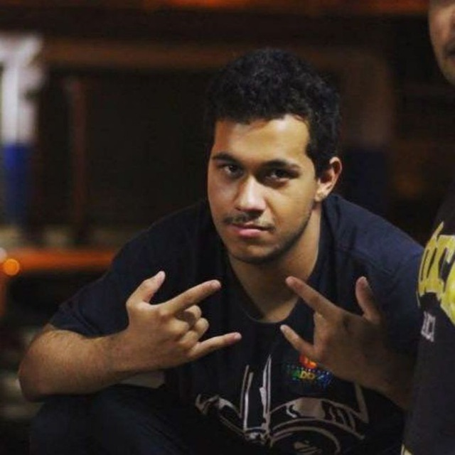

  

  
  <h3 style="color: #011640; text-align: center">
CAPJu é a sigla para "Controle e Acompanhamento de Processos da Justiça", um projeto de código aberto com o propósito de auxiliar os usuários de diversas Varas da Justiça Federal na gestão de processos legais. Este repositório contém exclusivamente a documentação do projeto, a qual é predominantemente em português do Brasil, visando atender aos interesses do público-alvo. O CAPJu é uma aplicação web compatível com todos os navegadores.
  </h3>

<h1 style="color: #011640; font-weight: bold; text-align: center"> Códigos fonte </h1>

<a href="https://github.com/fga-eps-mds/2023-1-CAPJu-Front">
  

	
  

	<h4 class="legenda">Frontend</h4>
	<h6 class=legenda>Mobile</h6>
</a>
<a href="https://github.com/fga-eps-mds/">
  

	
  

	<h4 class="legenda">MicroService</h4>
	<h6 class=legenda>Funny who you remember</h6>
</a>
<a href="https://github.com/fga-eps-mds/">
  

	
  

	<h4 class="legenda">MicroService</h4>
	<h6 class=legenda>Now i take to the skies</h6>
</a>

<h1 style="color: #011640; font-weight: bold; text-align: center"> Equipe </h1>
<h2 style="color: #011640; text-align: center"> MDS's </h2>

<a class="pessoa" href="https://github.com/AmandaMoura">
  

    
  

  <h4 class="legenda">Amanda De Moura</h4>
</a>
<a class="pessoa" href="https://github.com/EhOBruno">
  

    
  

  <h4 class="legenda">Bruno Ricardo de Menezes</h4>
</a>
<a class="pessoa" href="https://github.com/camilacareli">
  

    
  

  <h4 class="legenda">Camila Costa</h4>
</a>
<a class="pessoa" href="https://github.com/danielrogs">
  

    
  

  <h4 class="legenda">Daniel Rodrigues</h4>
</a>
<a class="pessoa" href="https://github.com/davirogs">
  

    
  

  <h4 class="legenda">Davi Rodrigues</h4>
</a>
<a class="pessoa" href="https://github.com/M0tt1nh4">
  

    
  

  <h4 class="legenda">Felipe de Oliveira</h4>
</a>
<a class="pessoa" href="https://github.com/LeanArs">
  

    
  

  <h4 class="legenda">Leandro Almeida</h4>
</a>

<h2 style="color: #011640; text-align: center"> EPS's </h2>

<a class="pessoa" href="https://github.com/brendavsantos">
  

    
  

  <h4 class="legenda">Brenda Santos</h4>
</a>
<a class="pessoa" href="https://github.com/Denniel-sudo">
  

    
  

  <h4 class="legenda">Denniel William</h4>
</a>
<a class="pessoa" href="https://github.com/JongaMatos">
  

    
  

  <h4 class="legenda">João Gabriel</h4>
</a>
<a class="pessoa" href="https://github.com/ngm1450">
  

    
  

  <h4 class="legenda">Nícolas Georgeos</h4>
</a>
<a class="pessoa" href="https://github.com/WashingtonBispo">
  

    
  

  <h4 class="legenda">Washington Bispo</h4>
</a>

