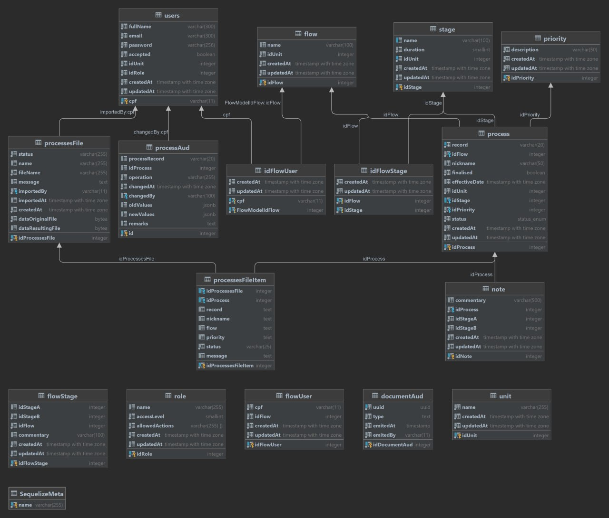

# Documento de Arquitetura

# 1. Introdução

## 1.1 Objetivo

&emsp;&emsp;O Documento de arquitetura de software descreve de forma abrangente a arquitetura do projeto, 
com finalidade de compreender e visualizar a estrutura do sistema, suas tecnologias e componentes, apontando 
as decisões arquiteturais da equipe ao longo do desenvolvimento do projeto.

## 1.2 Escopo

&emsp;&emsp;O projeto CAPJu consiste em uma aplicação web que tem como objetivo gerenciar processos jurídicos 
e automatizar tarefas repetitivas que eram realizadas por meio de planilhas, com uma proposta aos usuários poderem 
criar, controlar e acompanhar os processos jurídicos de forma mais eficiente e organizada.
 
&emsp;&emsp;Este documento abordará a arquitetura, tecnologias, frameworks e integrações entre os mecanismos 
utilizados no desenvolvimento da aplicação, sendo utilizado para uma gestão eficiente das arquiteturas utilizadas, 
diminuir riscos de conflitos entre as tecnologias utilizadas, além de uma estrutura bem formulada.

## 1.3 Definições, Acrônimos e Abreviações

| Sigla | Descrição |
| :---: | :---: |
| CAPJu | Controle e Acompanhamento de Processos da Justiça |
| HTTP | Hypertext Transfer Protocol |
| API | Application Programming Interface |
| CSS | Cascading Style Sheets |
| JSON | JavaScript Object Notation |

## 1.4 Visão Geral

&emsp;&emsp;O documento foi estruturado da seguinte forma, enquanto detalha os padrões arquiteturais do CAPJu e abordando
as tecnologias utilizadas para o desenvolvimento.

| | Tópico | Descição |
| :---: | :---: | :---: |
| 1 | Introdução | Fornece ao leitor uma visão geral do conteúdo abordado no documento |
| 2 | Representação da Arquitetura | Detalha a arquitetura utilizada no projeto e como ela está organizada |
| 3 | Metas e Restrições da Arquitetura | Descreve os objetivos do projeto, como também suas restrições, do ponto de vista arqutetural |
| 4 | Visão Lógica | Fornece ao leitor uma base para compreender a estrutura e a organização do design do sistema |
| 5 | Visão de Implantação | Fornece ao leitor uma base que permitirá compreender a distribuição física do sistema em um conjunto de nós de processamento |

# 2. Representação da Arquitetura

## 2.1 Tecnologias

&emsp;&emsp;A aplicação utilizadas no desenvolvimento tanto quanto no frontend e no bakcend são as seguintes:

* [Typescript](https://www.typescriptlang.org/)

&emsp;&emsp;TypeScript é um superconjunto de JavaScript desenvolvido pela Microsoft que adiciona tipagem e alguns outros recursos a linguagem.

* [Jest](https://jestjs.io/)
 
&emsp;&emsp;Jest é um framework de teste de JavaScript para gerar testes de forma simples e eficaz.

* [Vite](https://vitejs.dev/)
 
&emsp;&emsp;Vite é um build tool que permite que o desenvolvimento de aplicações frontend seja mais rápido e eficiente.

* [React](https://pt-br.reactjs.org/)
 
&emsp;&emsp;React é uma biblioteca JavaScript de código aberto com foco em criar interfaces de usuário em páginas web.

* [Styled Components](https://styled-components.com/)
 
&emsp;&emsp;Styled Components é uma biblioteca que permite escrever CSS em JavaScript.

* [Node.js](https://nodejs.org/en/)
 
&emsp;&emsp;Node.js é um ambiente de execução Javascript server-side, utilzando V8.

* [Express](https://expressjs.com/pt-br/)
 
&emsp;&emsp;Express é um framework para Node.js que fornece recursos mínimos para construção de servidores web.

* [Sequelize](https://sequelize.org/)
 
&emsp;&emsp;Sequelize é um ORM (Object-Relational Mapping) baseado em promessas para Node.js.

* [PostgreSQL](https://www.postgresql.org/)
 
&emsp;&emsp;PostgreSQL é um sistema gerenciador de banco de dados objeto relacional.

* [Docker](https://www.docker.com/)
 
&emsp;&emsp;Docker é uma plataforma de software que permite a criação, o teste e a implantação de aplicativos rapidamente.

* [Babel](https://babeljs.io/)
 
&emsp;&emsp;Babel é um compilador JavaScript gratuito e de código aberto e transpilador de JavaScript usado principalmente para converter o código ECMAScript 2015+ em uma versão compatível com versões anteriores do JavaScript em navegadores ou ambientes atuais e mais antigos.

# 3. Metas e Restrições da Arquitetura

## 3.1 Metas

* Reusabilidade de código
* Baixo acoplamento, facilitando a manutenção futura do código
* Tornar o desenvolvimento do aplicativo mais rápido

## 3.2 Restrições

* Depende de uma conexão com a internet
* Possuir conexão com o serviço de back-end por API HTTP;
* Possuir conexão com o Banco de Dados.

# 4. Visão Lógica

## 4.1 Visão Geral

&emsp;&emsp;O projeto CAPJu utiliza uma arquitetura MVC baseada em microsserviços. A sigla MVC vem dos termos em inglês Model (modelo) View (visão) e Controller (Controle). Essa arquitetura facilita a troca de informações entre a interface do usuário e dados no banco, fazendo com que as respostas sejam mais rápidas e dinâmicas. A base em microsserviços separa a camada de Visão da de Modelo e Controle em programas diferentes e independentes.
 
&emsp;&emsp;O servidor é dividido em 6 microsserviços, sendo eles: user, unit, processManagement, role, note, mailer, sendo eles para gerenciamento de usuários, gerenciamento de unidades, gerenciamento de processos, fluxos e etapas, gerenciamento de cargos e permissões, gerenciamento de notas como comentários e auditorias, e gerenciamento de e-mail e notificações, respectivamente.
 
&emsp;&emsp;O repositório Config é responsável por abrigar configurações do Nginx (funcionando como um proxy reverso) e do Banco de Dados.

# 5. Visão de Implantação

## 5.1 Diagrama de Entidade e Relacionamento

<!-- Possíveis mais tópicos -->

# Referências

# Histórico de Versões

| Data | Versão | Descrição | Autor(es) |
| :---: | :---: | :---: | :---: |
| 21/10/2023 | 0.1.0 | Criação do documento | Felipe Motta e Nícolas Georgeos |
